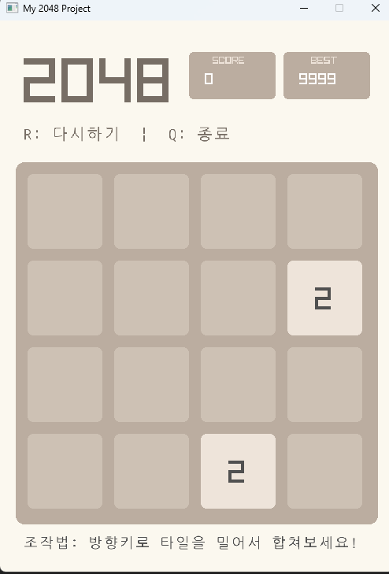
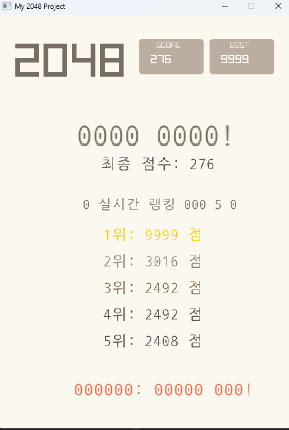
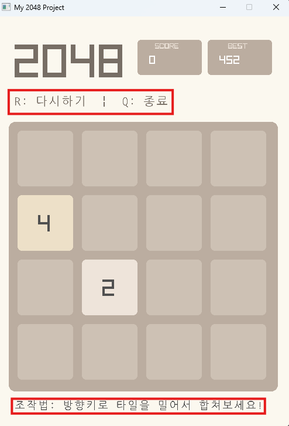

# iot-2048project-2026
2026년 Iot개발 miniProject 2

main.cpp: 게임 루프 (입력 받기 -> 로직 실행 -> 화면 출력).

GameManager.h / .cpp: 보드 데이터(4x4 배열), 숫자 생성, 이동 알고리즘(Move/Merge) 로직.

Renderer.h / .cpp: 콘솔 화면 지우기 및 컬러풀한 보드 출력.

### Tech Stack: 기술 스택 요약
1. programing Language
    - C++: 게임의 핵심 로직(Board클래스) 구현 및 객체지향 설계
    - 표준 라이브러리(STL): std::vector 를 활용한 랭킹 데이터 관리 및 자료 구조 실현

2.  Graphic Library (UI/UX)
    - Raylib:
        - 사용자 입력 처리: 키보드 이벤트를 통한 타일 이동 제어
        - 실시간 렌더링: 60FPS 기반의 부드러운 화면 전환 및 애니메이션 시각화.
        - 폰트 랜더링: LoadFontEx를 이용한 고해상도 한글 UI를 구현

3. Database(storage)
    - MySQL
        - 데이터 영속성: 게임 종료 시 사용자의 점수를 영구적으로 저장
        - 랭킹 시스템: SQL 쿼리를 통한 실시간 상위 점수 통계 산출

## 데이터 흐름 (Data Flow) 시각화
    - [사용자 입력] (Raylib) → [로직 연산] (C++ Board Class) → [화면 출력] (Raylib GUI) → [데이터 저장] (MySQL)

- 프로젝트 구조 내 Raylib의 위치 (Architecture)
    Raylib이 프로젝트의 어디에서 작동하는지 설명할 때는 아래와 같은 3계층 구조로 표현
    

- Logic (Model): Board.h / .cpp
    - 순수 C++로 작성된 2048 게임 알고리즘 (이동, 합치기, 점수 계산).
- Presentation (View): Raylib (GUI)(여기에 Raylib 위치)
    - 로직에서 계산된 배열 데이터를 화면에 사각형과 텍스트로 그려주는 역할.
- Data (Storage): MySQL
    - 최종 결과물을 보관하고 불러오는 저장소.

- 본 프로젝트는 C++의 강력한 로직 처리 능력을 바탕으로, Raylib 라이브러리를 통해 현대적인 GUI를 구현하고, MySQL 연동을 통해 실시간 랭킹 시스템을 구축한 통합 IoT 미니 프로젝트입니다."


- `프로젝트의 3대 핵심 가치`

- 객체지향 설계 (Encapsulation): 게임 로직(Board)과 출력 로직(Raylib)을 철저히 분리하여 코드의 재사용성과 유지보수성을 극대화했습니다.

- 데이터의 안정성 (Persistence & Safety): 외부 DB 연동을 통해 사용자 기록을 보존하고, isSaved 플래그로 데이터 중복 입력을 방지하는 안전장치를 마련했습니다.

- 사용자 경험 최적화 (UX & Troubleshooting): LoadFontEx를 활용한 고해상도 한글 렌더링과 렌더링 파이프라인(Begin/EndDrawing) 최적화로 폰트 깨짐과 화면 겹침 문제를 완벽히 해결했습니다.


## 1일차
###  1. 그래픽 라이브러리(Raylib) 통합

- 입력 방식 전환: 기존의 콘솔 기반 _getch() 방식에서 Raylib의 IsKeyPressed() 방식으로 완전히 교체했습니다. 이로써 그래픽 창이 활성화된 상태에서 방향키로 타일을 부드럽게 조작할 수 있게 되었습니다.

- UI 구현: 2048 특유의 베이지/갈색 톤 색상을 정의하고, 타일 숫자에 따라 색상이 변하는 GetTileColor 함수를 통해 시각적인 완성도를 높였습니다.

### 2. 게임 핵심 로직(Move) 고도화

- 이동 알고리즘 수정: dir == 3(오른쪽) 이동 시, 숫자들이 오른쪽 벽으로 끝까지 밀리지 않던 문제를 해결했습니다.
    - 역순 탐색: 오른쪽으로 밀 때는 가장 오른쪽 인덱스(3번)부터 거꾸로 검사해야 숫자들이 차례대로 쌓인다는 점을 반영했습니다.
- 중복 합치기 방지: 한 번의 이동으로 2, 2, 4가 한꺼번에 8이 되는 현상을 막기 위해 target 변수를 활용하여 "한 턴에 한 번만 합치기" 규칙을 정확히 구현했습니다.
- 조건문 구조 개선: if - else if 구조를 통해 방향 입력 간의 간섭을 없애고 로직의 안정성을 확보했습니다.

### 데이터베이스(MySQL) 연동 및 안전 장치
 - 점수 저장: 게임 종료 시(isGameOver) 혹은 사용자가 Q를 눌러 중단할 때, 현재 점수를 MySQL의 game_results 테이블에 자동으로 저장하는 saveToDB() 기능을 연결했습니다.
 - 중복 저장 방지: isSaved 플래그 변수를 도입하여, 게임 오버 화면에서 점수가 무한히 저장되는 버그를 사전에 차단했습니다.

### Raylib
설치하고 진행할 때 화면
.png>)

### 현재 코드 상태 (Checklist)
- [x] 4x4 그리드 탐색: j < 4 반복문을 통해 모든 칸을 정확히 스캔함.
- [x] 랜덤 스폰: 빈칸을 찾아 2(90%) 또는 4(10%)를 생성함.
- [x] 게임 오버 판정: 빈칸이 없고 더 이상 합칠 타일이 없을 때 정지함.
- [x] DB 커맨드: system() 함수를 통해 외부 MySQL 명령어를 성공적으로 호출함.


## 2일차

### 1. 리플레이 다시하기 생성
   
- R 키 재시작 기능: 게임 오버 상태에서 'R' 키를 입력받아 game.reset()을 호출함으로써 보드를 초기화하고 게임을 즉시 재시작하는 루프를 완성했습니다.

- 상태 초기화: 재시작 시 isSaved 플래그를 false로 되돌리고 topScores 벡터를 비워, 새로운 게임의 데이터가 다시 정상적으로 저장 및 로드되도록 설계했습니다.

### 최고 점수 화면



### 실시간 랭킹시스템



### 현재까지 완료된 기능 (Checklist)
[x] 4x4 보드 로직: 타일 이동 및 동일 숫자 병합 알고리즘 구현

[x] 랜덤 생성: 2 또는 4가 빈 칸에 무작위로 생성되는 시스템

[x] GUI 구현: Raylib을 이용한 타일, 배경, 점수판 시각화

[x] DB 연동: 게임 종료 시 MySQL에 최종 점수 자동 저장

[x] 한글 패치: LoadCodepoints를 이용한 UI 내 한글 출력 성공

[x] 실시간 랭킹 시스템: 이미 game.getTopScoresFromDB()를 호출하여 std::vector<int> topScores에 담고, 화면에 1위부터 5위까지 출력하는 로직이 들어가 있습니다.
    - static 변수를 활용해 게임 오버 시 딱 한 번만 DB에서 가져오도록 효율적으로 짜여 있습니다.
[x] Best Score 유지: 현재 세션뿐만 아니라 DB 내 최고 기록을 상단에 고정 표시.

[x] UI 디테일
- 안내 문구: 한글 폰트 깨짐을 해결하면서 조작법 안내(DrawTextEx) 위치를 화면 하단({ 30, 655 })으로 배치하여 보드판과 겹치지 않게 조정했습니다.



- "트러블슈팅(Troubleshooting)" 섹션
    - 문제: while 루프 밖의 잔여 코드로 인한 화면 겹침 및 폰트 깨짐 발생.
    - 해결: BeginDrawing()과 EndDrawing() 사이의 그리기 로직을 엄격히 분리하고, 폰트 로드 시 코드포인트(Codepoints) 범위를 명확히 지정하여 해결.


```BUSH
2048 프로젝트 핵심 구조도 (Conceptual Class Diagram)
1. Board 클래스 (The Model)
게임의 데이터와 핵심 규칙을 관리하는 가장 중요한 클래스입니다.
Attributes (멤버 변수)
int board[4][4]: 게임판의 숫자 데이터를 저장하는 2차원 배열.
int score: 현재 게임의 점수.
Methods (주요 함수)
init() / reset(): 보드를 0으로 초기화하고 랜덤하게 숫자 2개를 생성.
move(int dir): 상/하/좌/우 이동 로직 및 숫자 병합(Merge) 처리.
spawn(): 비어있는 칸 중 한 곳에 랜덤하게 2 또는 4를 생성.
isGameOver(): 더 이상 움직일 수 있는 칸이 없는지 판단.

DB 관련: saveToDB(), getBestScoreFromDB(), getTopScoresFromDB().

2. Main Loop (The Controller)
프로그램의 생명주기를 관리하며 입력과 출력을 연결합니다.

Input Handling: Raylib의 IsKeyPressed()를 사용하여 사용자 입력을 Board::move()로 전달.

State Management: 게임 진행 중인지, 게임 오버 상태인지를 판단하여 화면 분기 처리.

Exit Logic: 'Q' 입력 시 saveToDB() 호출 후 프로그램 안전 종료.

3. Renderer (The View)
Raylib 라이브러리를 사용하여 데이터를 시각화합니다.

Functions

DrawRectangleRounded(): 보드판과 타일의 둥근 사각형 그리기.

GetTileColor(int value): 숫자 크기에 따른 타일 색상 반환.

DrawTextEx(): 한글 폰트를 사용하여 점수, 랭킹, 안내 문구 출력.

🛠️ 데이터 흐름 (Data Flow)
입력: 사용자가 방향키를 누르면 Main에서 이를 감지합니다.

연산: Board 객체의 move() 함수가 실행되어 board[4][4] 배열의 데이터를 갱신하고 점수를 계산합니다.

출력: 갱신된 배열 데이터를 바탕으로 Renderer 로직이 화면에 타일을 다시 그립니다.

저장: 게임 종료 시 Board 클래스가 system() 명령을 통해 MySQL에 최종 점수를 전송합니다.

💡 발표 시 강조 포인트
캡슐화(Encapsulation): 게임 로직(Board)과 출력 로직(Raylib)을 분리하여 유지보수성을 높였습니다.

영속성(Persistence): 단순 휘발성 게임에 그치지 않고, 외부 데이터베이스와 연동하여 사용자 데이터를 보존하도록 설계했습니다.

예외 처리: isSaved 플래그를 통해 DB 중복 저장을 방지하는 등 소프트웨어 안정성을 고려했습니다.

```


